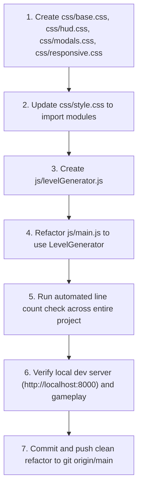

# Plan: Codebase Modularization & Refactoring (Strictly Under 500 Lines per File)

## 1. Current Codebase Audit

A scan of all active code files in the repository yields the following line counts:

| File Path | Current Lines | Status | Target Action |
| :--- | :--- | :--- | :--- |
| **`css/style.css`** | **1,096 lines** | ❌ Exceeds 500 | Split into 4 modular stylesheets + master index |
| **`js/main.js`** | **553 lines** | ❌ Exceeds 500 | Extract procedural level/enemy generator into `js/levelGenerator.js` |
| `js/renderer.js` | 477 lines |  Under 500 | Retain as is |
| `js/enemies.js` | 431 lines |  Under 500 | Retain as is |
| `index.html` | 255 lines |  Under 500 | Retain as is |
| `js/grid.js` | 254 lines |  Under 500 | Retain as is |
| `js/audio.js` | 221 lines |  Under 500 | Retain as is |
| `js/player.js` | 216 lines |  Under 500 | Retain as is |
| `js/spells.js` | 161 lines |  Under 500 | Retain as is |
| `js/font.js` | 151 lines |  Under 500 | Retain as is |
| `js/config.js` | 117 lines |  Under 500 | Retain as is |

Only **two files** currently exceed the 500-line threshold: `css/style.css` (1,096) and `js/main.js` (553).

---

## 2. Refactoring Strategy

### A. CSS Decomposition (`css/style.css` $\rightarrow$ 4 Focused Modules)

Currently, `css/style.css` bundles core resets, HUD elements, modal shop structures, and mobile responsiveness into a single monolithic 1,096-line file. We will split this into domain-specific stylesheets:

```
css/
├── base.css        (~120 lines): Fonts, design tokens, resets, body, wrapper, CRT scanlines/vignette
├── hud.css         (~270 lines): Top status bar, stamina/soul beads, canvas scaling, cast overlay, spell slots
├── modals.css      (~340 lines): Dialog overlays, Title screen, Font Sanctuary (Lady Xiao Yin), Game Over, Victory
├── responsive.css  (~260 lines): Mobile query overrides, Virtual D-Pad styling, landscape rules
└── style.css       (~15 lines) : Clean master stylesheet importing the modules via @import
```

#### Expected Line Count Post-Refactor:
- `css/base.css`: ~120 lines
- `css/hud.css`: ~270 lines
- `css/modals.css`: ~340 lines
- `css/responsive.css`: ~260 lines
- `css/style.css`: ~15 lines

*All CSS files will be well below 500 lines.*

---

### B. JavaScript Decomposition (`js/main.js` $\rightarrow$ `js/levelGenerator.js` + `js/main.js`)

In `js/main.js`, procedural map obstacle creation (`generateMapObstacles`) and floor enemy distribution (`spawnFloorEnemies`) take up 195 contiguous lines (lines 188–383).

We will create a dedicated module:
- **`js/levelGenerator.js`**:
  - `generateObstacles(grid, floorNum)`: Places thematic monoliths, crossroads, bastions, ruins, and boss arena pillars.
  - `spawnEnemies(grid, floorNum)`: Populates floors with Jiangshi, Wraiths, Corpse Scribes, and the Corpse Emperor Boss.

`js/main.js` will import and delegate to `LevelGenerator`:
```javascript
import { LevelGenerator } from './levelGenerator.js';

// In startFloor(floorNum):
LevelGenerator.generateObstacles(this.grid, floorNum);
this.enemies = LevelGenerator.spawnEnemies(this.grid, floorNum);
```

#### Expected Line Count Post-Refactor:
- `js/levelGenerator.js`: ~210 lines
- `js/main.js`: ~360 lines (down from 553 lines)

*All JavaScript files will be strictly under 500 lines.*

---

## 3. Step-by-Step Execution Plan



1. **Create CSS sub-modules**:
   - Extract design tokens, resets, scanlines into [`css/base.css`](file:///c:/Users/Benas/Documents/VS_Code/Test/Horror/Horror_MVP/css/base.css).
   - Extract status panels, canvas styling, cast bar, combat banner, and spell hotbars into [`css/hud.css`](file:///c:/Users/Benas/Documents/VS_Code/Test/Horror/Horror_MVP/css/hud.css).
   - Extract title screen, Lady Xiao Yin shopkeeper UI, stat refinement cards, talisman drafts, game over & victory modals into [`css/modals.css`](file:///c:/Users/Benas/Documents/VS_Code/Test/Horror/Horror_MVP/css/modals.css).
   - Extract responsive breakpoints and virtual D-pad into [`css/responsive.css`](file:///c:/Users/Benas/Documents/VS_Code/Test/Horror/Horror_MVP/css/responsive.css).
   - Replace [`css/style.css`](file:///c:/Users/Benas/Documents/VS_Code/Test/Horror/Horror_MVP/css/style.css) with an import manifest.
2. **Create `js/levelGenerator.js`**:
   - Export `LevelGenerator` containing `generateObstacles` and `spawnEnemies`.
3. **Refactor `js/main.js`**:
   - Import `LevelGenerator`.
   - Remove redundant obstacle/enemy generation code from `DemonicPagodaGame`.
4. **Verification**:
   - Execute PowerShell line counter to assert $\le 500$ lines for every single file.
   - Test rendering and input response on `http://localhost:8000`.
   - Push commit to GitHub `main` branch.
