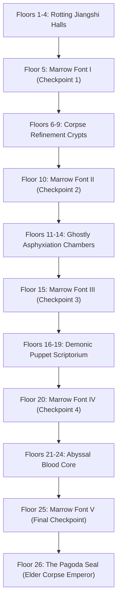
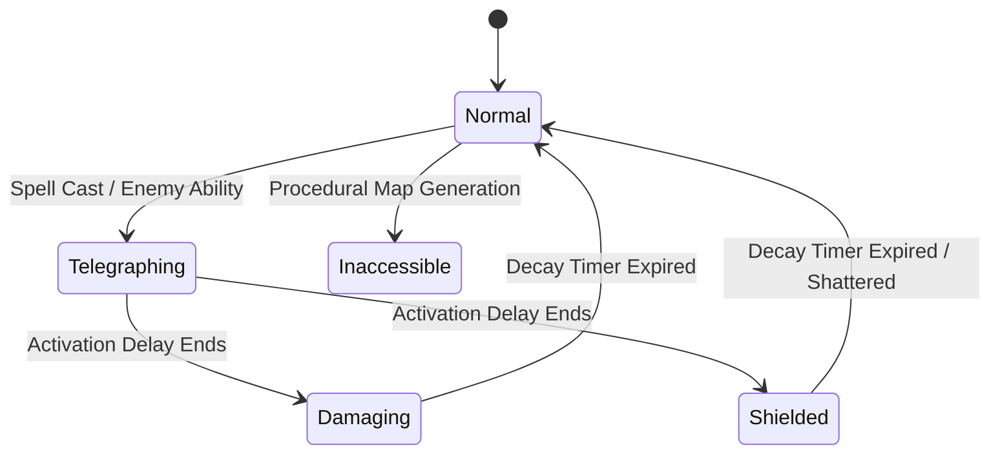

# The Blood Marrow Pagoda: Demonic Grid
## Comprehensive Design & Architecture (Current Setup)

### 1. Game Overview & Theme
*The Blood Marrow Pagoda* is a real-time, grid-based dark Xianxia horror action-RPG set in a 26-floor cursed pagoda used by demonic elders to refine corpses. Spatial geometry is distorted into a rigid $9 \times 9$ Yin energy grid.

- **Protagonist**: A rogue cultivator whose soul is bound to the pagoda.
- **Combat Style**: Real-time tile-to-tile maneuvering with chess-patterned demonic talismans that alter tile statuses.
- **Progression**: 26 floors total. Every 5 floors (Floors 5, 10, 15, 20, 25) lies a **Marrow Font** (Safe Floor), featuring the vampire shopkeeper **Lady Xiao Yin**, leading to the final confrontation on Floor 26 against the **Corpse Emperor**.

---

### 2. Core Player Attributes & Starting Loadout

| Stat | Starting Value | Effect | Upgrade Progression |
| :--- | :--- | :--- | :--- |
| **Health** | **1 Hit** | Total hits the cultivator soul can endure before annihilation. Taking any hit shatters 1 soul bead with **1.2s invulnerability (i-frames)** and recoil. | +1 Hit per upgrade at Marrow Font (e.g. 1 &rarr; 2 &rarr; 3 &rarr; 4). |
| **Agility** | **275 ms / step** | Real-time tile-to-tile step cooldown. Deliberate, high-tension speed demanding tactical spatial prediction against quick enemies. | Reduces step delay by 25ms each tier (e.g., 275ms &rarr; 250ms &rarr; 225ms &rarr; 200ms). |
| **Stamina** | **4 Casts / floor** | Number of spell charges available per floor. Fully restored automatically upon entering the next floor or safe zone. | +2 Casts per tier (e.g., 4 &rarr; 6 &rarr; 8 &rarr; 10). |

#### Starting Loadout:
- The player begins the game equipped **only with Pawn's Stride** in Slot 1.
- Slots 2, 3, and 4 start as `[Empty Slot]` (`➕ UNASSIGNED`).
- Players draft new demonic talismans into empty slots at Marrow Fonts.

---

### 3. Grid Tile Status Engine & Visual Signaling

The arena is a **$9 \times 9$ grid** (76px tiles, centered inside the 760×760 canvas).

#### A. Tile Status Specifications
1. **Normal Tile**: Walkable bone-brick floor.
2. **Player Damaging Tile (Jade Green Qi Spikes)**:
   - Rendered in **vibrant emerald / jade green** (`#10b981`) with lotus thorns.
   - **Safe for the player**: The player can walk on their own green tiles without taking damage.
   - **Lethal to enemies**: Any enemy stepping into or caught on a green tile takes 1 hit of damage.
3. **Enemy Damaging Tile (Crimson Blood Spikes)**:
   - Rendered in **pulsing blood red** (`#ff334b`).
   - Lethal to the player (deducts 1 Hit unless protected by a Shield).
   - Enemies are immune to their own crimson tiles.
4. **Tile Stacking Rule (Enemy Priority)**:
   - If an enemy attacks or casts a spell on a tile already covered by a player's green Qi, **the enemy's crimson danger layer and `⚠️` warning are rendered on top**.
   - Enemy telegraphs always render on top of player telegraphs, preventing players from mistaking an active hazard for a safe tile.
5. **Shielded Tile (Cyan Taoist Ward)**:
   - Immune to status alterations. Absorbs 1 physical hit or nullifies damaging blasts.
6. **Inaccessible Tile (Bone Monolith / Pillar)**:
   - Impassable barrier blocking player and ground enemies. Wraiths phase through.
   - Generated procedurally on each combat floor in geometric patterns (Monoliths, Crossroads, L-shapes, Ruins) to create tight movement lanes.

---

### 4. Spell Catalog: Chess Patterns & Scale/Delay Balance

All player spells create offensive or defensive zones. Inaccessible wall-creating spells were removed from the player catalog in favor of natural map obstacles.

> [!WARNING] Movement Lock While Channeling
> Casting roots the cultivator in place for the full activation delay.

| Spell Name | Chess Pattern | Effect | Range / Shape | Activation Delay | Description |
| :--- | :--- | :--- | :---: | :---: | :--- |
| **Pawn's Stride** | Forward Line | Damaging (Green) | **2 Tiles Ahead** | **0.35s** (Fast) | 2-tile spear thrust in facing direction. |
| **Knight's Talon** | 8 L-Shapes around player | Damaging (Green) | 8 Tiles | **0.95s** (Medium) | Skips immediate neighbors to impale surrounding area. |
| **Rook's Severance** | Orthogonal Cross | Damaging (Green) | 4 Tiles each direction | **1.35s** (Medium) | Piercing straight-line Yin blades clearing rows/cols. |
| **Bishop's Gaze** | Diagonal X | Damaging (Green) | 4 Tiles each diagonal | **1.35s** (Medium) | Diagonal spatial rupture. |
| **Tortoise Sanctuary** | King's Cross | Shielded (Cyan) | Caster + 4 Cardinals | **0.50s** (Fast) | Purifying ward protecting against damage and status. |
| **Queen's Ruin** | Full Cross + Diagonals | Damaging (Green) | Full Arena (20+ tiles) | **3.00s** (Extreme Root) | Board-wide apocalypse. **Blood Sacrifice**: If any enemies survive the blast, caster loses 1 Hit! |

---

### 5. Safe Floors (Marrow Fonts) & Vampire Shopkeeper

Located on **Floors 5, 10, 15, 20, and 25**.

#### A. Lady Xiao Yin — Marrow Alchemist
- Rendered on the left side of the sanctuary interface in a circular golden frame.
- Ancient young lady vampire who weaves human marrow into demonic talismans.

#### B. Sanctuary Mechanics
1. **Full Restoration**: Instantly restores all soul hits and full stamina.
2. **Stat Upgrades**:
   - *Bone Weaving* (+1 Max Hit) - 40 Marrow base (+20 per tier).
   - *Wind-Stepping Soul* (+Agility / -25ms step time) - 25 Marrow base (+15 per tier).
   - *Meridian Cleansing* (+2 Max Stamina casts/floor) - 20 Marrow base (+15 per tier).
3. **Talisman Drafting**: 3 randomized spells offered per font. Can be equipped into any slot (1, 2, 3, or 4).

---

### 6. Checkpoint System

- Reaching any Marrow Font safe floor (**5, 10, 15, 20, 25**) automatically records a persistent checkpoint snapshot.
- The snapshot preserves:
  - Checkpoint floor number.
  - Upgraded Max Hits, Agility, and Max Stamina.
  - Harvested Marrow balance.
  - Equipped spell slots and Altar price scaling.
- **Game Over Flow**:
  - `[REVIVE AT CHECKPOINT]`: Revives directly inside the latest reached Marrow Font sanctuary with Lady Xiao Yin, fully healed and fully charged.
  - `[START FRESH (FLOOR 1)]`: Optional button for a clean restart from Floor 1.

---

### 7. Hosting on GitHub Pages (Step-by-Step)

The project is already committed and pushed to `https://github.com/BenasDe/Horror_MVP.git` on the `main` branch. All asset paths and module imports are relative (`./`), making it 100% compatible with GitHub Pages.

#### Step 1: Open Repository Settings
1. Navigate to your repository: [https://github.com/BenasDe/Horror_MVP](https://github.com/BenasDe/Horror_MVP)
2. Click on the **Settings** tab (top right gear icon).

#### Step 2: Configure Pages
1. In the left navigation menu under **Code and automation**, click **Pages**.
2. Under **Build and deployment**:
   - **Source**: Select `Deploy from a branch`.
   - **Branch**: Select `main`.
   - **Folder**: Select `/ (root)`.
3. Click **Save**.

#### Step 3: Access Live Game
- Within 1 to 2 minutes, GitHub Actions will publish your site.
- Your game will be live at:
  👉 **`https://benasde.github.io/Horror_MVP/`**

---

### 8. Mobile Responsiveness & Touch Architecture

- **Viewport & Dynamic Height**:
  - Configured with `<meta name="viewport" content="width=device-width, initial-scale=1.0, maximum-scale=1.0, user-scalable=no, viewport-fit=cover">`.
  - Body and game wrapper utilize `100dvh` to handle mobile browser address bars smoothly without scrolling or layout jumps.
- **Canvas Scaling**:
  - The internal canvas resolution remains fixed at $760 \times 760$ for pixel-crisp coordinate calculations.
  - Responsive CSS scaling with `max-width: 100%; max-height: 100%; aspect-ratio: 1 / 1; object-fit: contain;` dynamically fits portrait and landscape screens.
- **Dual Touch Controls**:
  1. **Virtual D-Pad**: Semi-transparent gothic directional controls in `#canvas-container` supporting single taps and continuous hold movement tied to the agility step cooldown.
  2. **Canvas Gesture Swipes**: Cardinal touch swipe detection directly across the grid (`touchstart` / `touchend` with directional thresholding).
- **Responsive Layouts**:
  - **Top HUD**: Compact badge flexbox with scaled soul beads and stamina pips.
  - **Bottom Hotbar**: Single-row 4-slot layout with hidden descriptions and touch-to-cast action.
  - **Modals**: Flexible single-column flow with scrolling for Lady Xiao Yin's sanctuary shop and game over screens.
